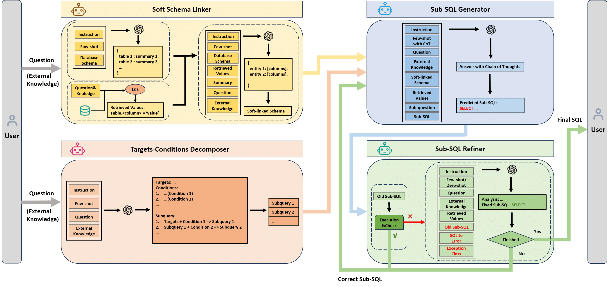

## 📖 Introduction

Thank you for your interest in our work: MAG-SQL: Multi-Agent Generative Approach with Soft Schema Linking and Iterative Sub-SQL Refinement for Text-to-SQL

You can find our paper [[here]](https://arxiv.org/abs/2408.07930). In this paper, we propose MAG-SQL, a multi-agent generative approach with soft schema linking and iterative Sub-SQL refinement. In our framework, an entity-based method with tables' summary is used to select the columns in database, and a novel targets-conditions decomposition method is introduced to decompose those complex questions. Additionally, we build a iterative generating module which includes a Sub-SQL Generator and Sub-SQL Refiner, introducing external oversight for each step of generation. The workflow is shown below: 



## 🌍 Environment

1. Config your local environment.

```bash
conda create -n magsql python=3.9 -y
conda activate magsql
cd MAG-SQL
pip install -r requirements.txt
python -c "import nltk; nltk.download('punkt')"
```

Note: we use `openai==0.28.1`, which use `openai.ChatCompletions.create` to call api.

1. Edit openai config at **main_scripts/llm.py**, and set related environment variables of Azure OpenAI API.


## 📜 Data Preparation
The main dataset we used is BIRD(https://bird-bench.github.io/). 
For evaluation, the data should be in **data/bird/dev**


## 🚀 Run

You can enter the following commands at the command line to evaluate and change the corresponding file paths
```bash
python run.py --dataset_name bird --dataset_mode dev --input_file ./data/bird/dev/dev.json --db_path ./data/bird/dev/dev_databases/ --tables_json_path ./data/bird/dev/dev_tables.json --output_file ./output/gpt4_mag.json --log_file ./output/log/log/txt --start_pos 0 
```

## 📑 Evaluation

We provide the script for Linux systems.
**evaluation_bird_ex_ves.sh**

## 🎈 Useful Resources

Our project is built based on: [[Repo]](https://github.com/wbbeyourself/MAC-SQL)

## 📰 Citation 
If you find our work is helpful, please cite as:
```text
@article{xie2024mag,
  title={MAG-SQL: Multi-Agent Generative Approach with Soft Schema Linking and Iterative Sub-SQL Refinement for Text-to-SQL},
  author={Xie, Wenxuan and Wu, Gaochen and Zhou, Bowen},
  journal={arXiv preprint arXiv:2408.07930},
  year={2024}
}
```